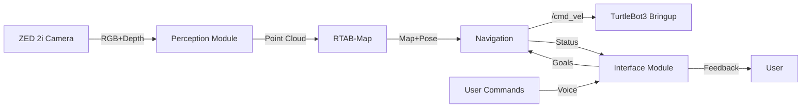

# 시각장애인 안내 로봇 프레임워크 구현 가이드

## 목차
1. [시스템 아키텍처](#1-시스템-아키텍처)
2. [프로젝트 구조](#2-프로젝트-구조)
3. [핵심 모듈 구현](#3-핵심-모듈-구현)
4. [빌드 및 설정](#4-빌드-및-설정)
5. [API 레퍼런스](#5-api-레퍼런스)
6. [배포 가이드](#6-배포-가이드)

## 1. 시스템 아키텍처

### 1.1 전체 구조
```
┌─────────────────────────────────────────────────────────┐
│                    User Interface Layer                   │
│            (Audio I/O, Haptic Feedback, Commands)        │
├─────────────────────────────────────────────────────────┤
│                    Application Layer                      │
│         (Task Planning, State Machine, Safety)           │
├─────────────────────────────────────────────────────────┤
│                     Service Layer                        │
│    (Navigation, SLAM, Object Detection, Path Planning)   │
├─────────────────────────────────────────────────────────┤
│                 Hardware Abstraction Layer               │
│        (Sensor Drivers, TurtleBot3 I/F, GPIO)            │
├─────────────────────────────────────────────────────────┤
│                    Communication Layer                   │
│                    (ROS2 DDS Middleware)                 │
└─────────────────────────────────────────────────────────┘
```

### 1.2 데이터 플로우


### 1.3 통신 아키텍처
- **DDS Domain ID**: 42
- **QoS Profiles**:
  - Sensor Data: Best Effort, Volatile, Keep Last 1
  - Navigation Commands: Reliable, Transient Local, Keep Last 10
  - Safety Messages: Reliable, Transient Local, Keep All

## 2. 프로젝트 구조

### 2.1 디렉토리 레이아웃
```bash
modular-v/
├── core/                          # 핵심 프레임워크
│   ├── include/core/             # 헤더 파일
│   │   ├── module_interface.hpp
│   │   ├── module_manager.hpp
│   │   └── config_manager.hpp
│   ├── src/                      # 소스 파일
│   │   ├── module_manager.cpp
│   │   └── config_manager.cpp
│   └── CMakeLists.txt
│
├── modules/                       # 기능 모듈
│   ├── perception/
│   │   ├── camera_module/
│   │   │   ├── include/camera_module/
│   │   │   ├── src/
│   │   │   ├── config/
│   │   │   └── CMakeLists.txt
│   │   ├── rtabmap_module/
│   │   └── detection_module/
│   │
│   ├── navigation/
│   │   ├── path_planner/
│   │   ├── local_planner/
│   │   └── obstacle_avoidance/
│   │
│   ├── mobility/
│   │   ├── base_controller/
│   │   └── odometry/
│   │
│   └── interaction/
│       ├── audio_interface/
│       ├── haptic_interface/
│       └── command_processor/
│
├── interfaces/                    # ROS2 인터페이스 정의
│   ├── msg/
│   │   ├── ModuleStatus.msg
│   │   ├── ObstacleInfo.msg
│   │   └── NavigationCommand.msg
│   ├── srv/
│   │   ├── SetDestination.srv
│   │   └── EmergencyStop.srv
│   └── action/
│       └── NavigateToGoal.action
│
├── launch/                        # 런치 파일
│   ├── system_bringup.launch.py
│   ├── perception.launch.py
│   ├── navigation.launch.py
│   └── simulation.launch.py
│
├── config/                        # 설정 파일
│   ├── system_config.yaml
│   ├── sensor_config.yaml
│   ├── navigation_params.yaml
│   └── safety_zones.yaml
│
├── scripts/                       # 유틸리티 스크립트
│   ├── setup_environment.sh
│   ├── calibrate_sensors.py
│   └── system_health_check.py
│
├── tests/                         # 테스트
│   ├── unit/
│   ├── integration/
│   └── system/
│
├── docker/                        # Docker 설정
│   ├── Dockerfile
│   ├── docker-compose.yml
│   └── .env.example
│
├── docs/                          # 문서
│   ├── FRAMEWORK_GUIDE.md
│   ├── API_REFERENCE.md
│   ├── DEPLOYMENT.md
│   └── TROUBLESHOOTING.md
│
├── package.xml                    # ROS2 패키지 정의
├── CMakeLists.txt                # 최상위 빌드 설정
├── README.md
└── .gitignore
```

## 3. 핵심 모듈 구현

### 3.1 기본 모듈 인터페이스

#### IModule 베이스 클래스
```cpp
// core/include/core/module_interface.hpp
#ifndef CORE_MODULE_INTERFACE_HPP
#define CORE_MODULE_INTERFACE_HPP

#include <rclcpp/rclcpp.hpp>
#include <string>
#include <memory>

namespace modular_v {
namespace core {

enum class ModuleState {
    UNINITIALIZED,
    INITIALIZED,
    RUNNING,
    PAUSED,
    ERROR,
    TERMINATED
};

class IModule {
public:
    virtual ~IModule() = default;

    // 생명주기 메서드
    virtual bool initialize() = 0;
    virtual bool start() = 0;
    virtual bool pause() = 0;
    virtual bool resume() = 0;
    virtual bool stop() = 0;
    virtual bool shutdown() = 0;

    // 상태 관리
    virtual ModuleState getState() const = 0;
    virtual std::string getName() const = 0;
    virtual std::string getVersion() const = 0;

    // 설정 관리
    virtual bool loadConfig(const std::string& config_path) = 0;
    virtual bool saveConfig(const std::string& config_path) = 0;

    // 헬스 체크
    virtual bool isHealthy() const = 0;
    virtual std::string getHealthStatus() const = 0;

protected:
    rclcpp::Node::SharedPtr node_;
    ModuleState state_ = ModuleState::UNINITIALIZED;
    std::string name_;
    std::string version_;
};

} // namespace core
} // namespace modular_v

#endif // CORE_MODULE_INTERFACE_HPP
```

### 3.2 카메라 모듈 구현 예제

```cpp
// modules/perception/camera_module/include/camera_module/zed_camera_module.hpp
#ifndef ZED_CAMERA_MODULE_HPP
#define ZED_CAMERA_MODULE_HPP

#include "core/module_interface.hpp"
#include <sl/Camera.hpp>
#include <sensor_msgs/msg/image.hpp>
#include <sensor_msgs/msg/point_cloud2.hpp>

namespace modular_v {
namespace perception {

class ZedCameraModule : public core::IModule {
public:
    ZedCameraModule();
    ~ZedCameraModule() override;

    // IModule 인터페이스 구현
    bool initialize() override;
    bool start() override;
    bool stop() override;
    bool shutdown() override;

    // 기타 필수 메서드들...

private:
    void captureLoop();
    void publishImage(const sl::Mat& image);
    void publishPointCloud(const sl::Mat& point_cloud);

    // ZED SDK
    std::unique_ptr<sl::Camera> zed_;
    sl::InitParameters init_params_;
    sl::RuntimeParameters runtime_params_;

    // ROS2 Publishers
    rclcpp::Publisher<sensor_msgs::msg::Image>::SharedPtr image_pub_;
    rclcpp::Publisher<sensor_msgs::msg::Image>::SharedPtr depth_pub_;
    rclcpp::Publisher<sensor_msgs::msg::PointCloud2>::SharedPtr pc_pub_;

    // 스레드
    std::thread capture_thread_;
    std::atomic<bool> running_{false};

    // 설정
    struct Config {
        int resolution = 2;  // 720p
        int fps = 15;
        float depth_minimum_distance = 0.3f;
        float depth_maximum_distance = 20.0f;
        bool enable_imu = true;
    } config_;
};

} // namespace perception
} // namespace modular_v

#endif // ZED_CAMERA_MODULE_HPP
```

#### 구현 파일
```cpp
// modules/perception/camera_module/src/zed_camera_module.cpp
#include "camera_module/zed_camera_module.hpp"
#include <pcl_conversions/pcl_conversions.hpp>

namespace modular_v {
namespace perception {

ZedCameraModule::ZedCameraModule() {
    name_ = "ZED Camera Module";
    version_ = "1.0.0";
}

bool ZedCameraModule::initialize() {
    try {
        // ROS2 노드 생성
        node_ = rclcpp::Node::make_shared("zed_camera_module");

        // Publisher 설정
        image_pub_ = node_->create_publisher<sensor_msgs::msg::Image>(
            "/zed2i/image_raw", 10);
        depth_pub_ = node_->create_publisher<sensor_msgs::msg::Image>(
            "/zed2i/depth/image_rect", 10);
        pc_pub_ = node_->create_publisher<sensor_msgs::msg::PointCloud2>(
            "/zed2i/point_cloud", 10);

        // ZED 카메라 초기화
        zed_ = std::make_unique<sl::Camera>();

        init_params_.camera_resolution = sl::RESOLUTION::HD720;
        init_params_.camera_fps = config_.fps;
        init_params_.coordinate_units = sl::UNIT::METER;
        init_params_.coordinate_system = sl::COORDINATE_SYSTEM::RIGHT_HANDED_Z_UP;
        init_params_.depth_mode = sl::DEPTH_MODE::ULTRA;
        init_params_.depth_minimum_distance = config_.depth_minimum_distance;
        init_params_.depth_maximum_distance = config_.depth_maximum_distance;

        auto err = zed_->open(init_params_);
        if (err != sl::ERROR_CODE::SUCCESS) {
            RCLCPP_ERROR(node_->get_logger(),
                "Failed to open ZED camera: %s", sl::toString(err).c_str());
            return false;
        }

        // 런타임 파라미터 설정
        runtime_params_.sensing_mode = sl::SENSING_MODE::FILL;
        runtime_params_.enable_depth = true;

        state_ = ModuleState::INITIALIZED;
        RCLCPP_INFO(node_->get_logger(), "ZED Camera Module initialized successfully");
        return true;

    } catch (const std::exception& e) {
        RCLCPP_ERROR(node_->get_logger(), "Initialization failed: %s", e.what());
        return false;
    }
}

bool ZedCameraModule::start() {
    if (state_ != ModuleState::INITIALIZED && state_ != ModuleState::PAUSED) {
        return false;
    }

    running_ = true;
    capture_thread_ = std::thread(&ZedCameraModule::captureLoop, this);
    state_ = ModuleState::RUNNING;

    RCLCPP_INFO(node_->get_logger(), "ZED Camera Module started");
    return true;
}

void ZedCameraModule::captureLoop() {
    sl::Mat image, depth, point_cloud;

    while (running_ && rclcpp::ok()) {
        if (zed_->grab(runtime_params_) == sl::ERROR_CODE::SUCCESS) {
            // RGB 이미지 획득
            zed_->retrieveImage(image, sl::VIEW::LEFT);
            publishImage(image);

            // Depth 이미지 획득
            zed_->retrieveImage(depth, sl::VIEW::DEPTH);
            publishDepth(depth);

            // Point Cloud 획득
            zed_->retrieveMeasure(point_cloud, sl::MEASURE::XYZRGBA);
            publishPointCloud(point_cloud);
        }

        // 프레임 레이트 제어
        std::this_thread::sleep_for(std::chrono::milliseconds(1000 / config_.fps));
    }
}

// ... 추가 구현 ...

} // namespace perception
} // namespace modular_v
```

### 3.3 RTAB-Map 모듈 설정

```yaml
# config/rtabmap_config.yaml
rtabmap:
  ros__parameters:
    # 기본 설정
    frame_id: "base_link"
    odom_frame_id: "odom"
    map_frame_id: "map"

    # 데이터베이스
    database_path: "~/.ros/rtabmap.db"

    # SLAM 모드
    Mem/IncrementalMemory: "true"
    Mem/InitWMWithAllNodes: "false"

    # 특징점 추출
    Kp/DetectorStrategy: "6"  # GFTT/BRIEF
    Kp/MaxFeatures: "400"

    # Loop Closure
    Rtabmap/LoopThr: "0.11"
    Reg/Strategy: "1"          # ICP
    Reg/Force3DoF: "true"      # 2D 환경

    # 맵 필터링
    Grid/CellSize: "0.05"      # 5cm
    Grid/RangeMax: "10.0"      # 10m
    Grid/ClusterRadius: "0.1"
    Grid/GroundIsObstacle: "false"

    # 최적화
    Optimizer/Strategy: "1"     # g2o
    Optimizer/Iterations: "20"

    # 메모리 관리
    Rtabmap/MemoryThr: "0"     # 무제한
    Rtabmap/MaxRetrieved: "2"

    # 시각화
    subscribe_depth: true
    subscribe_rgb: true
    subscribe_scan: false
    approx_sync: true
```

### 3.4 Navigation Stack 설정

```yaml
# config/navigation_params.yaml
bt_navigator:
  ros__parameters:
    use_sim_time: false
    global_frame: map
    robot_base_frame: base_link
    odom_topic: /odom
    bt_loop_duration: 10
    default_server_timeout: 20
    plugin_lib_names:
      - nav2_compute_path_to_pose_action_bt_node
      - nav2_follow_path_action_bt_node
      - nav2_back_up_action_bt_node
      - nav2_spin_action_bt_node
      - nav2_wait_action_bt_node
      - nav2_clear_costmap_service_bt_node
      - nav2_is_stuck_condition_bt_node
      - nav2_goal_reached_condition_bt_node
      - nav2_initial_pose_received_condition_bt_node
      - nav2_reinitialize_global_localization_service_bt_node
      - nav2_rate_controller_bt_node
      - nav2_distance_controller_bt_node
      - nav2_speed_controller_bt_node
      - nav2_recovery_node_bt_node
      - nav2_pipeline_sequence_bt_node
      - nav2_round_robin_node_bt_node
      - nav2_transform_available_condition_bt_node
      - nav2_time_expired_condition_bt_node
      - nav2_distance_traveled_condition_bt_node

controller_server:
  ros__parameters:
    use_sim_time: false
    controller_frequency: 20.0
    min_x_velocity_threshold: 0.001
    min_y_velocity_threshold: 0.5
    min_theta_velocity_threshold: 0.001
    progress_checker_plugin: "progress_checker"
    goal_checker_plugin: "goal_checker"
    controller_plugins: ["FollowPath"]

    # Progress checker
    progress_checker:
      plugin: "nav2_controller::SimpleProgressChecker"
      required_movement_radius: 0.5
      movement_time_allowance: 10.0

    # Goal checker
    goal_checker:
      plugin: "nav2_controller::SimpleGoalChecker"
      xy_goal_tolerance: 0.25
      yaw_goal_tolerance: 0.25
      stateful: true

    # DWA Controller
    FollowPath:
      plugin: "dwb_core::DWBLocalPlanner"
      min_vel_x: 0.0
      max_vel_x: 1.0
      min_vel_y: 0.0
      max_vel_y: 0.0
      max_vel_theta: 1.0
      min_speed_xy: 0.0
      max_speed_xy: 1.0
      min_speed_theta: 0.0
      acc_lim_x: 2.5
      acc_lim_y: 0.0
      acc_lim_theta: 3.2
      decel_lim_x: -2.5
      decel_lim_y: 0.0
      decel_lim_theta: -3.2
      vx_samples: 20
      vy_samples: 1
      vtheta_samples: 40
      sim_time: 2.0
      linear_granularity: 0.05
      angular_granularity: 0.025
      transform_tolerance: 0.2
      trans_stopped_velocity: 0.25
      short_circuit_trajectory_evaluation: true
      stateful: true
      critics:
        - RotateToGoal
        - Oscillation
        - BaseObstacle
        - GoalAlign
        - PathAlign
        - PathDist
        - GoalDist
      BaseObstacle.scale: 0.02
      PathAlign.scale: 32.0
      GoalAlign.scale: 24.0
      PathAlign.forward_point_distance: 0.1
      GoalAlign.forward_point_distance: 0.1
      PathDist.scale: 32.0
      GoalDist.scale: 24.0
      RotateToGoal.scale: 32.0
      RotateToGoal.slowing_factor: 5.0
      RotateToGoal.lookahead_time: -1.0

planner_server:
  ros__parameters:
    use_sim_time: false
    planner_plugins: ["GridBased"]

    GridBased:
      plugin: "nav2_navfn_planner/NavfnPlanner"
      tolerance: 0.5
      use_astar: false
      allow_unknown: true

local_costmap:
  local_costmap:
    ros__parameters:
      update_frequency: 5.0
      publish_frequency: 2.0
      global_frame: odom
      robot_base_frame: base_link
      use_sim_time: false
      rolling_window: true
      width: 3
      height: 3
      resolution: 0.05
      footprint: "[[0.3, 0.3], [0.3, -0.3], [-0.3, -0.3], [-0.3, 0.3]]"
      plugins: ["obstacle_layer", "inflation_layer"]

      obstacle_layer:
        plugin: "nav2_costmap_2d::ObstacleLayer"
        enabled: true
        observation_sources: pointcloud
        pointcloud:
          topic: /zed2i/point_cloud
          max_obstacle_height: 2.0
          min_obstacle_height: 0.1
          clearing: true
          marking: true
          data_type: "PointCloud2"

      inflation_layer:
        plugin: "nav2_costmap_2d::InflationLayer"
        cost_scaling_factor: 3.0
        inflation_radius: 0.5

global_costmap:
  global_costmap:
    ros__parameters:
      update_frequency: 1.0
      publish_frequency: 1.0
      global_frame: map
      robot_base_frame: base_link
      use_sim_time: false
      footprint: "[[0.3, 0.3], [0.3, -0.3], [-0.3, -0.3], [-0.3, 0.3]]"
      resolution: 0.05
      track_unknown_space: true
      plugins: ["static_layer", "obstacle_layer", "inflation_layer"]

      static_layer:
        plugin: "nav2_costmap_2d::StaticLayer"
        map_subscribe_transient_local: true

      obstacle_layer:
        plugin: "nav2_costmap_2d::ObstacleLayer"
        enabled: true
        observation_sources: pointcloud
        pointcloud:
          topic: /zed2i/point_cloud
          max_obstacle_height: 2.0
          min_obstacle_height: 0.1
          clearing: true
          marking: true
          data_type: "PointCloud2"

      inflation_layer:
        plugin: "nav2_costmap_2d::InflationLayer"
        cost_scaling_factor: 3.0
        inflation_radius: 0.5
```

## 4. 빌드 및 설정

### 4.1 CMakeLists.txt (최상위)

```cmake
cmake_minimum_required(VERSION 3.16)
project(modular_v VERSION 1.0.0)

# C++ 표준 설정
set(CMAKE_CXX_STANDARD 17)
set(CMAKE_CXX_STANDARD_REQUIRED ON)

# 컴파일 최적화 (Jetson용)
set(CMAKE_CXX_FLAGS "${CMAKE_CXX_FLAGS} -O3 -march=native")
if(CMAKE_CUDA_COMPILER)
  set(CMAKE_CUDA_ARCHITECTURES 87)  # Jetson Orin
endif()

# ROS2 패키지 찾기
find_package(ament_cmake REQUIRED)
find_package(rclcpp REQUIRED)
find_package(std_msgs REQUIRED)
find_package(sensor_msgs REQUIRED)
find_package(geometry_msgs REQUIRED)
find_package(nav_msgs REQUIRED)
find_package(tf2_ros REQUIRED)
find_package(cv_bridge REQUIRED)
find_package(pcl_ros REQUIRED)

# 외부 라이브러리
find_package(OpenCV 4 REQUIRED)
find_package(PCL 1.12 REQUIRED)
find_package(Eigen3 REQUIRED)

# ZED SDK (옵션)
find_package(ZED 3 QUIET)
if(ZED_FOUND)
  add_definitions(-DHAS_ZED)
endif()

# Include 디렉토리
include_directories(
  core/include
  ${OpenCV_INCLUDE_DIRS}
  ${PCL_INCLUDE_DIRS}
)

# 서브디렉토리 추가
add_subdirectory(core)
add_subdirectory(modules/perception/camera_module)
add_subdirectory(modules/perception/rtabmap_module)
add_subdirectory(modules/navigation)
add_subdirectory(modules/mobility)
add_subdirectory(modules/interaction)

# 인터페이스 생성
rosidl_generate_interfaces(${PROJECT_NAME}
  "interfaces/msg/ModuleStatus.msg"
  "interfaces/msg/ObstacleInfo.msg"
  "interfaces/msg/NavigationCommand.msg"
  "interfaces/srv/SetDestination.srv"
  "interfaces/srv/EmergencyStop.srv"
  "interfaces/action/NavigateToGoal.action"
  DEPENDENCIES std_msgs geometry_msgs
)

# 설치
install(DIRECTORY
  launch
  config
  DESTINATION share/${PROJECT_NAME}
)

# 테스트
if(BUILD_TESTING)
  find_package(ament_lint_auto REQUIRED)
  ament_lint_auto_find_test_dependencies()
  add_subdirectory(tests)
endif()

ament_package()
```

### 4.2 package.xml

```xml
<?xml version="1.0"?>
<package format="3">
  <name>modular_v</name>
  <version>1.0.0</version>
  <description>Visual Impairment Assistant Robot Framework</description>
  <maintainer email="your_email@example.com">Your Name</maintainer>
  <license>MIT</license>

  <buildtool_depend>ament_cmake</buildtool_depend>
  <buildtool_depend>rosidl_default_generators</buildtool_depend>

  <!-- Core Dependencies -->
  <depend>rclcpp</depend>
  <depend>std_msgs</depend>
  <depend>sensor_msgs</depend>
  <depend>geometry_msgs</depend>
  <depend>nav_msgs</depend>
  <depend>tf2_ros</depend>
  <depend>cv_bridge</depend>
  <depend>pcl_ros</depend>

  <!-- Navigation Stack -->
  <depend>navigation2</depend>
  <depend>nav2_bringup</depend>

  <!-- SLAM -->
  <depend>rtabmap_ros</depend>

  <!-- Hardware Drivers -->
  <depend>zed_ros2_wrapper</depend>

  <!-- Testing -->
  <test_depend>ament_lint_auto</test_depend>
  <test_depend>ament_lint_common</test_depend>
  <test_depend>ament_cmake_gtest</test_depend>

  <member_of_group>rosidl_interface_packages</member_of_group>

  <export>
    <build_type>ament_cmake</build_type>
  </export>
</package>
```

## 5. API 레퍼런스

### 5.1 모듈 매니저 API

```cpp
class ModuleManager {
public:
    // 모듈 등록/해제
    bool registerModule(const std::string& name,
                       std::shared_ptr<IModule> module);
    bool unregisterModule(const std::string& name);

    // 모듈 제어
    bool startModule(const std::string& name);
    bool stopModule(const std::string& name);
    bool pauseModule(const std::string& name);
    bool resumeModule(const std::string& name);

    // 모듈 조회
    std::shared_ptr<IModule> getModule(const std::string& name);
    std::vector<std::string> getModuleList() const;
    ModuleState getModuleState(const std::string& name) const;

    // 시스템 제어
    bool startAll();
    bool stopAll();
    bool emergencyStop();

    // 헬스 모니터링
    bool checkSystemHealth();
    std::map<std::string, bool> getModuleHealthStatus();
};
```

### 5.2 ROS2 서비스 인터페이스

```python
# 목적지 설정 서비스
from modular_v.srv import SetDestination

def set_destination_callback(request, response):
    # request.x, request.y, request.theta
    # response.success, response.message
    pass

# 긴급 정지 서비스
from modular_v.srv import EmergencyStop

def emergency_stop_callback(request, response):
    # request.reason
    # response.success
    pass
```

### 5.3 Action 인터페이스

```python
# 네비게이션 액션
from modular_v.action import NavigateToGoal
import rclpy
from rclpy.action import ActionClient

class NavigationClient:
    def __init__(self):
        self._action_client = ActionClient(
            self, NavigateToGoal, 'navigate_to_goal')

    def send_goal(self, x, y, theta):
        goal_msg = NavigateToGoal.Goal()
        goal_msg.target_pose.position.x = x
        goal_msg.target_pose.position.y = y
        goal_msg.target_pose.orientation.z = theta

        self._send_goal_future = self._action_client.send_goal_async(
            goal_msg, feedback_callback=self.feedback_callback)

    def feedback_callback(self, feedback_msg):
        # feedback_msg.feedback.distance_remaining
        # feedback_msg.feedback.estimated_time_remaining
        pass
```

## 6. 배포 가이드

### 6.1 Docker 설정

```dockerfile
# docker/Dockerfile
FROM nvcr.io/nvidia/l4t-ml:r35.2.1-py3

# 시스템 패키지 설치
RUN apt-get update && apt-get install -y \
    curl \
    gnupg2 \
    lsb-release \
    build-essential \
    cmake \
    git \
    libeigen3-dev \
    libpcl-dev \
    && rm -rf /var/lib/apt/lists/*

# ROS2 설치
RUN curl -sSL https://raw.githubusercontent.com/ros/rosdistro/master/ros.key \
    -o /usr/share/keyrings/ros-archive-keyring.gpg
RUN echo "deb [arch=$(dpkg --print-architecture) signed-by=/usr/share/keyrings/ros-archive-keyring.gpg] \
    http://packages.ros.org/ros2/ubuntu $(lsb_release -cs) main" \
    | tee /etc/apt/sources.list.d/ros2.list > /dev/null
RUN apt-get update && apt-get install -y \
    ros-humble-desktop \
    ros-humble-navigation2 \
    ros-humble-nav2-bringup \
    ros-humble-rtabmap-ros \
    python3-colcon-common-extensions \
    && rm -rf /var/lib/apt/lists/*

# ZED SDK 설치 (수동 다운로드 필요)
# COPY ZED_SDK_Tegra_L4T35.1_v3.8.run /tmp/
# RUN chmod +x /tmp/ZED_SDK_*.run && \
#     /tmp/ZED_SDK_*.run -- silent skip_tools && \
#     rm /tmp/ZED_SDK_*.run

# 작업 디렉토리 설정
WORKDIR /workspace

# 소스 코드 복사
COPY . /workspace/src/modular_v/

# 빌드
RUN . /opt/ros/humble/setup.sh && \
    cd /workspace && \
    colcon build --symlink-install \
        --cmake-args -DCMAKE_BUILD_TYPE=Release

# 엔트리포인트 설정
COPY docker/entrypoint.sh /
RUN chmod +x /entrypoint.sh
ENTRYPOINT ["/entrypoint.sh"]

CMD ["ros2", "launch", "modular_v", "system_bringup.launch.py"]
```

### 6.2 시스템 시작 스크립트

```bash
#!/bin/bash
# scripts/start_system.sh

# 환경 설정
source /opt/ros/humble/setup.bash
source ~/workspace/install/setup.bash

# 시스템 체크
echo "Checking system requirements..."

# CUDA 체크
if ! command -v nvcc &> /dev/null; then
    echo "Warning: CUDA not found"
fi

# 카메라 연결 체크
if ! ls /dev/video* &> /dev/null; then
    echo "Warning: No camera devices found"
fi

# ROS2 데몬 시작
ros2 daemon start

# 시스템 파라미터 설정
export ROS_DOMAIN_ID=42
export RMW_IMPLEMENTATION=rmw_cyclonedds_cpp
export RCUTILS_CONSOLE_OUTPUT_FORMAT='[{severity} {time}] [{name}]: {message}'

# 로그 디렉토리 생성
mkdir -p ~/modular_v_logs/$(date +%Y%m%d_%H%M%S)
export ROS_LOG_DIR=~/modular_v_logs/$(date +%Y%m%d_%H%M%S)

# 시스템 시작
echo "Starting Modular-V System..."
ros2 launch modular_v system_bringup.launch.py \
    use_sim_time:=false \
    enable_slam:=true \
    enable_navigation:=true \
    enable_voice:=true \
    config_dir:=$HOME/workspace/src/modular_v/config
```

### 6.3 시스템 모니터링

```python
#!/usr/bin/env python3
# scripts/system_monitor.py

import rclpy
from rclpy.node import Node
from modular_v.msg import ModuleStatus
import psutil
import subprocess

class SystemMonitor(Node):
    def __init__(self):
        super().__init__('system_monitor')

        # Publishers
        self.status_pub = self.create_publisher(
            ModuleStatus, '/system/status', 10)

        # Timers
        self.create_timer(1.0, self.publish_status)
        self.create_timer(5.0, self.check_health)

        # 모듈 리스트
        self.modules = [
            'zed_camera_module',
            'rtabmap_module',
            'navigation_module',
            'audio_interface_module'
        ]

    def publish_status(self):
        """시스템 상태 발행"""
        msg = ModuleStatus()
        msg.timestamp = self.get_clock().now().to_msg()
        msg.cpu_usage = psutil.cpu_percent()
        msg.memory_usage = psutil.virtual_memory().percent
        msg.temperature = self.get_temperature()

        self.status_pub.publish(msg)

    def check_health(self):
        """모듈 헬스 체크"""
        for module in self.modules:
            # 노드 존재 여부 확인
            result = subprocess.run(
                ['ros2', 'node', 'list'],
                capture_output=True, text=True
            )

            if module in result.stdout:
                self.get_logger().debug(f'{module} is running')
            else:
                self.get_logger().warning(f'{module} is not running')

    def get_temperature(self):
        """Jetson 온도 읽기"""
        try:
            with open('/sys/class/thermal/thermal_zone0/temp', 'r') as f:
                temp = float(f.read()) / 1000.0
                return temp
        except:
            return 0.0

def main(args=None):
    rclpy.init(args=args)
    monitor = SystemMonitor()
    rclpy.spin(monitor)
    monitor.destroy_node()
    rclpy.shutdown()

if __name__ == '__main__':
    main()
```

### 6.4 런치 파일 예제

```python
# launch/system_bringup.launch.py
from launch import LaunchDescription
from launch.actions import DeclareLaunchArgument, IncludeLaunchDescription
from launch.launch_description_sources import PythonLaunchDescriptionSource
from launch.substitutions import LaunchConfiguration, PathJoinSubstitution
from launch_ros.actions import Node
from launch_ros.substitutions import FindPackageShare

def generate_launch_description():
    # 패키지 경로
    pkg_modular_v = FindPackageShare('modular_v')

    # Launch 인자
    use_sim_time = LaunchConfiguration('use_sim_time', default='false')
    enable_slam = LaunchConfiguration('enable_slam', default='true')
    enable_navigation = LaunchConfiguration('enable_navigation', default='true')

    # 설정 파일 경로
    config_dir = PathJoinSubstitution([
        pkg_modular_v, 'config'
    ])

    # 카메라 모듈
    camera_node = Node(
        package='modular_v',
        executable='zed_camera_module',
        name='zed_camera_module',
        parameters=[{
            'use_sim_time': use_sim_time,
            'config_file': PathJoinSubstitution([
                config_dir, 'sensor_config.yaml'
            ])
        }],
        output='screen'
    )

    # RTAB-Map
    rtabmap_launch = IncludeLaunchDescription(
        PythonLaunchDescriptionSource([
            PathJoinSubstitution([
                FindPackageShare('rtabmap_ros'), 'launch', 'rtabmap.launch.py'
            ])
        ]),
        launch_arguments={
            'use_sim_time': use_sim_time,
            'args': '--delete_db_on_start',
            'rgb_topic': '/zed2i/image_raw',
            'depth_topic': '/zed2i/depth/image_rect',
            'camera_info_topic': '/zed2i/camera_info',
            'frame_id': 'base_link',
            'approx_sync': 'true',
            'rviz': 'false'
        }.items()
    )

    # Navigation Stack
    navigation_launch = IncludeLaunchDescription(
        PythonLaunchDescriptionSource([
            PathJoinSubstitution([
                FindPackageShare('nav2_bringup'), 'launch', 'navigation_launch.py'
            ])
        ]),
        launch_arguments={
            'use_sim_time': use_sim_time,
            'params_file': PathJoinSubstitution([
                config_dir, 'navigation_params.yaml'
            ])
        }.items()
    )

    # 시스템 모니터
    monitor_node = Node(
        package='modular_v',
        executable='system_monitor.py',
        name='system_monitor',
        output='screen'
    )

    return LaunchDescription([
        # Launch 인자 선언
        DeclareLaunchArgument('use_sim_time'),
        DeclareLaunchArgument('enable_slam'),
        DeclareLaunchArgument('enable_navigation'),

        # 노드 실행
        camera_node,
        rtabmap_launch,
        navigation_launch,
        monitor_node
    ])
```

## 7. 테스트 가이드

### 7.1 단위 테스트 예제

```cpp
// tests/unit/test_camera_module.cpp
#include <gtest/gtest.h>
#include "camera_module/zed_camera_module.hpp"

class CameraModuleTest : public ::testing::Test {
protected:
    void SetUp() override {
        module_ = std::make_shared<modular_v::perception::ZedCameraModule>();
    }

    std::shared_ptr<modular_v::perception::ZedCameraModule> module_;
};

TEST_F(CameraModuleTest, InitializeTest) {
    EXPECT_TRUE(module_->initialize());
    EXPECT_EQ(module_->getState(), modular_v::core::ModuleState::INITIALIZED);
}

TEST_F(CameraModuleTest, StartStopTest) {
    ASSERT_TRUE(module_->initialize());
    EXPECT_TRUE(module_->start());
    EXPECT_EQ(module_->getState(), modular_v::core::ModuleState::RUNNING);

    std::this_thread::sleep_for(std::chrono::seconds(1));

    EXPECT_TRUE(module_->stop());
    EXPECT_EQ(module_->getState(), modular_v::core::ModuleState::INITIALIZED);
}
```

### 7.2 통합 테스트

```python
#!/usr/bin/env python3
# tests/integration/test_navigation_integration.py

import unittest
import rclpy
from rclpy.action import ActionClient
from modular_v.action import NavigateToGoal
from geometry_msgs.msg import PoseStamped
import time

class NavigationIntegrationTest(unittest.TestCase):
    @classmethod
    def setUpClass(cls):
        rclpy.init()
        cls.node = rclpy.create_node('test_navigation')
        cls.action_client = ActionClient(
            cls.node, NavigateToGoal, 'navigate_to_goal')

    def test_simple_navigation(self):
        """간단한 네비게이션 테스트"""
        goal = NavigateToGoal.Goal()
        goal.target_pose.position.x = 2.0
        goal.target_pose.position.y = 1.0
        goal.target_pose.orientation.z = 0.0

        # 목표 전송
        future = self.action_client.send_goal_async(goal)
        rclpy.spin_until_future_complete(self.node, future)

        goal_handle = future.result()
        self.assertTrue(goal_handle.accepted)

        # 결과 대기
        result_future = goal_handle.get_result_async()
        rclpy.spin_until_future_complete(self.node, result_future)

        result = result_future.result().result
        self.assertTrue(result.success)

    @classmethod
    def tearDownClass(cls):
        cls.node.destroy_node()
        rclpy.shutdown()

if __name__ == '__main__':
    unittest.main()
```

## 8. 트러블슈팅

### 8.1 일반적인 문제 해결

| 문제 | 원인 | 해결 방법 |
|------|------|-----------|
| ZED 카메라 연결 실패 | USB 권한 문제 | `sudo usermod -a -G dialout $USER` 후 재로그인 |
| RTAB-Map 메모리 부족 | 맵 크기 과다 | `Rtabmap/MemoryThr` 파라미터 조정 |
| Navigation 목표 도달 실패 | Costmap 설정 문제 | inflation_radius 및 cost_scaling_factor 조정 |
| 시스템 과열 | 높은 CPU/GPU 사용률 | 프레임레이트 감소, 열 관리 개선 |

### 8.2 로그 분석

```bash
# 실시간 로그 확인
ros2 topic echo /rosout

# 특정 노드 로그
ros2 run rqt_console rqt_console

# 로그 레벨 설정
ros2 run demo_nodes_cpp talker --ros-args --log-level debug
```

이 문서는 시각장애인 안내 로봇 시스템의 구현을 위한 상세 가이드입니다. 각 섹션을 참고하여 단계적으로 구현하시면 됩니다.