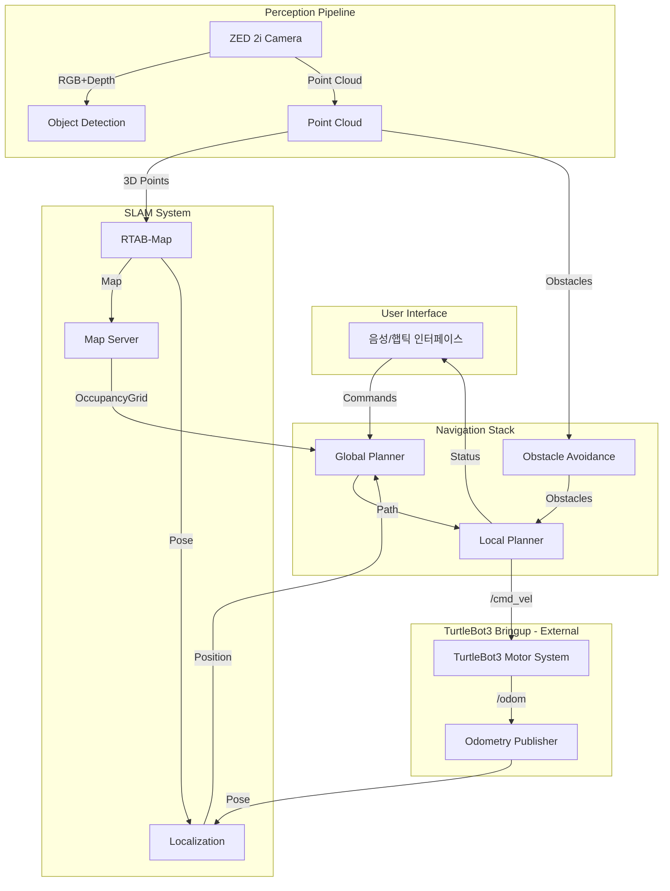

# 시스템 아키텍처 설계서

## 1. 시스템 개요

### 1.1 목적
본 시스템은 시각장애인이 실내외 환경에서 안전하게 이동할 수 있도록 지원하는 자율 안내 로봇 플랫폼입니다. 실시간 환경 인식, 장애물 회피, 음성 안내를 통해 사용자에게 독립적인 이동 능력을 제공합니다.

### 1.2 핵심 설계 원칙
- **모듈성 (Modularity)**: 각 기능을 독립적인 모듈로 분리하여 유지보수와 확장이 용이
- **실시간성 (Real-time)**: 안전을 위한 실시간 반응 보장
- **신뢰성 (Reliability)**: 장애 복구 및 안전 메커니즘 구현
- **확장성 (Scalability)**: 새로운 센서 및 기능 추가 용이
- **접근성 (Accessibility)**: 직관적인 음성/햅틱 인터페이스

## 2. 시스템 아키텍처

### 2.1 계층 구조

```
┌────────────────────────────────────────────────────────────┐
│                    Application Layer                        │
│                                                             │
│  ┌──────────────┐  ┌──────────────┐  ┌──────────────┐    │
│  │ Task Manager │  │State Machine │  │Safety Monitor│    │
│  └──────────────┘  └──────────────┘  └──────────────┘    │
├────────────────────────────────────────────────────────────┤
│                    Service Layer                           │
│                                                             │
│  ┌──────────────┐  ┌──────────────┐  ┌──────────────┐    │
│  │  Perception  │  │  Navigation  │  │  Interaction │    │
│  │   Service    │  │   Service    │  │   Service    │    │
│  └──────────────┘  └──────────────┘  └──────────────┘    │
├────────────────────────────────────────────────────────────┤
│                    Module Layer                            │
│                                                             │
│  ┌──────┐ ┌──────┐ ┌──────┐ ┌──────┐ ┌──────┐           │
│  │Camera│ │ SLAM │ │Planner│ │Voice │ │Haptic│           │
│  └──────┘ └──────┘ └──────┘ └──────┘ └──────┘           │
├────────────────────────────────────────────────────────────┤
│                Hardware Abstraction Layer                  │
│                                                             │
│  ┌──────────────┐  ┌──────────────┐  ┌──────────────┐    │
│  │Sensor Driver │  │TurtleBot3 I/F│  │ GPIO Handler │    │
│  └──────────────┘  └──────────────┘  └──────────────┘    │
├────────────────────────────────────────────────────────────┤
│                   Communication Layer                      │
│                    (ROS2 / DDS)                           │
└────────────────────────────────────────────────────────────┘
```

### 2.2 모듈 간 상호작용



## 3. 핵심 컴포넌트 설계

### 3.1 Module Interface

```cpp
namespace modular_v::core {

// 모듈 상태 정의
enum class ModuleState {
    UNINITIALIZED,  // 초기화되지 않음
    INITIALIZED,    // 초기화 완료
    RUNNING,        // 실행 중
    PAUSED,         // 일시 정지
    ERROR,          // 오류 상태
    TERMINATED      // 종료됨
};

// 모듈 우선순위
enum class Priority {
    CRITICAL = 0,   // 안전 관련 모듈
    HIGH = 1,       // 핵심 기능 모듈
    NORMAL = 2,     // 일반 모듈
    LOW = 3         // 부가 기능 모듈
};

// 기본 모듈 인터페이스
class IModule {
public:
    virtual ~IModule() = default;

    // 생명주기 관리
    virtual bool initialize() = 0;
    virtual bool start() = 0;
    virtual bool pause() = 0;
    virtual bool resume() = 0;
    virtual bool stop() = 0;
    virtual bool shutdown() = 0;

    // 상태 조회
    virtual ModuleState getState() const = 0;
    virtual Priority getPriority() const = 0;
    virtual std::string getName() const = 0;

    // 설정 관리
    virtual bool configure(const Config& config) = 0;
    virtual Config getConfig() const = 0;

    // 진단
    virtual DiagnosticStatus getDiagnostics() const = 0;
    virtual bool selfTest() = 0;
};

}
```

### 3.2 Module Manager

```cpp
class ModuleManager {
private:
    // 모듈 저장소
    std::map<std::string, std::shared_ptr<IModule>> modules_;

    // 의존성 그래프
    std::map<std::string, std::vector<std::string>> dependencies_;

    // 실행 스레드 풀
    std::vector<std::thread> worker_threads_;

    // 상태 관리
    std::atomic<SystemState> system_state_;

public:
    // 모듈 관리
    bool registerModule(const std::string& name,
                       std::shared_ptr<IModule> module,
                       const std::vector<std::string>& deps = {});

    // 시스템 제어
    bool initializeSystem();
    bool startSystem();
    bool stopSystem();

    // 의존성 해결
    std::vector<std::string> getInitializationOrder();
    bool checkDependencies(const std::string& module);

    // 모니터링
    SystemHealth getSystemHealth();
    void handleModuleFailure(const std::string& module);
};
```

### 3.3 Communication Manager

```cpp
class CommunicationManager {
private:
    rclcpp::Node::SharedPtr node_;

    // 토픽 관리
    std::map<std::string, rclcpp::PublisherBase::SharedPtr> publishers_;
    std::map<std::string, rclcpp::SubscriptionBase::SharedPtr> subscribers_;

    // 서비스 관리
    std::map<std::string, rclcpp::ServiceBase::SharedPtr> services_;
    std::map<std::string, rclcpp::ClientBase::SharedPtr> clients_;

public:
    // 토픽 생성
    template<typename MessageT>
    void createPublisher(const std::string& topic,
                        const rclcpp::QoS& qos = rclcpp::QoS(10));

    template<typename MessageT>
    void createSubscriber(const std::string& topic,
                         std::function<void(MessageT)> callback,
                         const rclcpp::QoS& qos = rclcpp::QoS(10));

    // 메시지 발행
    template<typename MessageT>
    void publish(const std::string& topic, const MessageT& msg);

    // 서비스 생성
    template<typename ServiceT>
    void createService(const std::string& name,
                      std::function<void(ServiceT::Request,
                                       ServiceT::Response)> handler);
};
```

## 4. 데이터 플로우

### 4.1 센서 데이터 처리

```
ZED 2i Camera (15Hz)
    ├── RGB Image ────────────> Object Detection
    ├── Depth Image ──────────> Point Cloud Generation
    ├── Point Cloud ──────────> Obstacle Detection
    └── IMU Data (400Hz) ─────> Pose Estimation

GPS/RTK (1Hz, outdoor only)
    └── Global Position ──────> Localization Fusion
```

### 4.2 SLAM 파이프라인

```
Input Sources:
    ├── Point Cloud (15Hz)
    ├── RGB Image (15Hz)
    └── Odometry (20Hz)
           ↓
    RTAB-Map Processing
           ↓
    ┌──────────────┐
    │ Loop Closure │
    │  Detection   │
    └──────────────┘
           ↓
    ┌──────────────┐
    │Graph Optimize│
    └──────────────┘
           ↓
Output:
    ├── 3D Map (1Hz)
    ├── 2D OccupancyGrid (1Hz)
    └── Localization (30Hz)
```

### 4.3 Navigation 플로우

```
User Command / Destination
           ↓
    ┌──────────────┐
    │Global Planner│ ← Map
    └──────────────┘
           ↓
       Global Path
           ↓
    ┌──────────────┐
    │Local Planner │ ← Obstacles
    └──────────────┘
           ↓
     /cmd_vel (Velocity)
           ↓
    ┌──────────────────┐
    │TurtleBot3 Bringup│ (External)
    └──────────────────┘
           ↓
      Robot Motion
```

## 5. 통신 프로토콜

### 5.1 ROS2 토픽 구조

| 토픽 이름 | 메시지 타입 | 발행 주기 | QoS 설정 |
|-----------|------------|-----------|----------|
| /zed2i/image_raw | sensor_msgs/Image | 15Hz | Best Effort |
| /zed2i/depth/image | sensor_msgs/Image | 15Hz | Best Effort |
| /zed2i/point_cloud | sensor_msgs/PointCloud2 | 15Hz | Best Effort |
| /rtabmap/grid_map | nav_msgs/OccupancyGrid | 1Hz | Reliable |
| /map | nav_msgs/OccupancyGrid | 1Hz | Transient Local, Reliable |
| /rtabmap/localization_pose | geometry_msgs/PoseWithCovarianceStamped | 30Hz | Best Effort |
| /cmd_vel | geometry_msgs/Twist | 20Hz | Reliable |
| /path | nav_msgs/Path | 1Hz | Reliable |
| /obstacles | modular_v/ObstacleArray | 10Hz | Best Effort |
| /system/status | modular_v/SystemStatus | 1Hz | Reliable |

**Note**: `/rtabmap/grid_map` is relayed to `/map` by rtabmap_wrapper for Nav2 compatibility.

### 5.2 서비스 인터페이스

| 서비스 이름 | 타입 | 용도 |
|------------|------|------|
| /system/start | std_srvs/Trigger | 시스템 시작 |
| /system/stop | std_srvs/Trigger | 시스템 정지 |
| /system/emergency_stop | std_srvs/Trigger | 긴급 정지 |
| /navigation/set_goal | modular_v/SetGoal | 목적지 설정 |
| /navigation/cancel | std_srvs/Trigger | 네비게이션 취소 |
| /slam/save_map | rtabmap_msgs/SaveMap | 맵 저장 |
| /slam/load_map | rtabmap_msgs/LoadMap | 맵 로드 |

### 5.3 액션 인터페이스

```yaml
# NavigateToGoal.action
# Goal
geometry_msgs/PoseStamped target_pose
float32 max_velocity
bool avoid_obstacles
---
# Result
bool success
string message
float32 final_distance_error
---
# Feedback
float32 distance_remaining
float32 estimated_time_remaining
float32 current_velocity
```

## 6. 상태 관리

### 6.1 시스템 상태 머신

```
        ┌─────────────┐
        │UNINITIALIZED│
        └─────┬───────┘
              │ initialize()
        ┌─────▼───────┐
        │ INITIALIZED │
        └─────┬───────┘
              │ start()
        ┌─────▼───────┐
     ┌──│   RUNNING   │──┐
     │  └─────────────┘  │
  pause()             stop()
     │                   │
┌────▼─────┐       ┌─────▼────┐
│  PAUSED  │       │ STOPPING │
└────┬─────┘       └─────┬────┘
  resume()               │
     │             ┌─────▼────┐
     └────────────>│TERMINATED│
                   └──────────┘

Emergency Stop → EMERGENCY_STOP (from any state)
Error → ERROR (from any state)
```

### 6.2 모듈 상태 동기화

```cpp
class StateManager {
private:
    // 상태 저장소
    std::map<std::string, ModuleState> module_states_;
    std::mutex state_mutex_;

    // 상태 변경 콜백
    std::vector<StateChangeCallback> callbacks_;

public:
    // 상태 업데이트
    void updateModuleState(const std::string& module,
                          ModuleState new_state);

    // 상태 조회
    ModuleState getModuleState(const std::string& module);
    SystemState getSystemState();

    // 상태 변경 알림
    void registerStateChangeCallback(StateChangeCallback cb);

    // 상태 일관성 검사
    bool checkStateConsistency();
    void resolveStateConflicts();
};
```

## 7. 안전 메커니즘

### 7.1 안전 영역 정의

```cpp
struct SafetyZones {
    float emergency_stop_distance = 0.3f;  // 긴급 정지
    float warning_distance = 0.5f;         // 경고 영역
    float slow_down_distance = 1.0f;       // 감속 영역
    float comfort_distance = 1.5f;         // 편안한 거리
};
```

### 7.2 Fail-Safe 메커니즘

```cpp
class SafetyMonitor {
private:
    // 워치독 타이머
    std::map<std::string, WatchdogTimer> watchdogs_;

    // 안전 체크
    std::atomic<bool> emergency_stop_triggered_;

public:
    void startMonitoring();
    void checkModuleHealth(const std::string& module);
    void triggerEmergencyStop(const std::string& reason);

    // 복구 메커니즘
    bool attemptRecovery(const std::string& module);
    void escalateToManualControl();
};
```

### 7.3 오류 처리 전략

| 오류 레벨 | 설명 | 처리 방법 |
|----------|------|-----------|
| INFO | 정보성 메시지 | 로깅만 수행 |
| WARNING | 경고 상황 | 로깅 및 알림 |
| ERROR | 복구 가능한 오류 | 재시도 또는 대체 경로 |
| CRITICAL | 심각한 오류 | 모듈 재시작 |
| FATAL | 치명적 오류 | 시스템 안전 정지 |

## 8. 성능 최적화

### 8.1 메모리 관리

```cpp
class MemoryManager {
private:
    // 메모리 풀
    std::vector<std::unique_ptr<MemoryPool>> pools_;

    // 캐시 관리
    LRUCache<std::string, std::shared_ptr<void>> cache_;

public:
    // 메모리 할당
    template<typename T>
    std::shared_ptr<T> allocate();

    // 메모리 해제
    template<typename T>
    void deallocate(std::shared_ptr<T> ptr);

    // 가비지 컬렉션
    void garbageCollect();

    // 메모리 사용량 모니터링
    MemoryStats getMemoryUsage();
};
```

### 8.2 스레드 관리

```cpp
class ThreadManager {
private:
    // 스레드 풀
    ThreadPool computation_pool_;  // 연산 집약적 작업
    ThreadPool io_pool_;           // I/O 작업
    ThreadPool realtime_pool_;     // 실시간 작업

    // 스케줄링
    TaskScheduler scheduler_;

public:
    // 작업 제출
    template<typename Func>
    auto submit(Func&& f, Priority priority = Priority::NORMAL);

    // CPU 친화도 설정
    void setCPUAffinity(std::thread::id tid,
                       const std::vector<int>& cores);

    // 우선순위 설정
    void setThreadPriority(std::thread::id tid, int priority);
};
```

### 8.3 GPU 가속

```cpp
// CUDA 기반 Point Cloud 처리
namespace cuda {
    void processPointCloud(const float* input_points,
                          float* output_points,
                          int num_points,
                          const TransformMatrix& transform);

    void voxelGridFilter(const PointCloud& input,
                        PointCloud& output,
                        float voxel_size);

    void removeOutliers(PointCloud& cloud,
                       int k_neighbors,
                       float std_dev_threshold);
}

// TensorRT 기반 딥러닝 추론
class TensorRTInference {
private:
    nvinfer1::ICudaEngine* engine_;
    nvinfer1::IExecutionContext* context_;

public:
    void loadModel(const std::string& model_path);
    void infer(const cv::Mat& input,
              std::vector<Detection>& detections);
};
```

## 9. 확장성 설계

### 9.1 플러그인 시스템

```cpp
class PluginInterface {
public:
    virtual ~PluginInterface() = default;
    virtual std::string getName() const = 0;
    virtual std::string getVersion() const = 0;
    virtual bool initialize(const Config& config) = 0;
    virtual void execute() = 0;
};

class PluginManager {
private:
    std::map<std::string, std::shared_ptr<PluginInterface>> plugins_;

public:
    bool loadPlugin(const std::string& path);
    bool unloadPlugin(const std::string& name);
    std::shared_ptr<PluginInterface> getPlugin(const std::string& name);
};
```

### 9.2 설정 관리 시스템

```cpp
class ConfigManager {
private:
    YAML::Node root_config_;
    std::map<std::string, YAML::Node> module_configs_;

public:
    // 설정 로드
    bool loadConfig(const std::string& path);

    // 설정 조회
    template<typename T>
    T get(const std::string& key, const T& default_value);

    // 동적 재설정
    void setParameter(const std::string& key, const YAML::Node& value);

    // 설정 검증
    bool validateConfig(const ConfigSchema& schema);

    // 설정 저장
    bool saveConfig(const std::string& path);
};
```

## 10. 테스트 및 검증

### 10.1 테스트 레벨

1. **단위 테스트**: 개별 모듈 기능 검증
2. **통합 테스트**: 모듈 간 상호작용 검증
3. **시스템 테스트**: 전체 시스템 동작 검증
4. **성능 테스트**: 실시간 성능 요구사항 검증
5. **안전 테스트**: 안전 메커니즘 검증

### 10.2 시뮬레이션 환경

```yaml
# Gazebo 시뮬레이션 설정
simulation:
  world: "indoor_office.world"
  robot_model: "modular_v.urdf"
  sensors:
    - type: "stereo_camera"
      update_rate: 15
    - type: "imu"
      update_rate: 400
  physics:
    update_rate: 1000
    gravity: [0, 0, -9.8]
```

### 10.3 검증 메트릭

| 메트릭 | 목표값 | 측정 방법 |
|--------|--------|-----------|
| 위치 정확도 | < 10cm | Ground Truth 대비 RMSE |
| 장애물 감지율 | > 95% | True Positive Rate |
| 경로 추종 오차 | < 20cm | 계획 경로 대비 편차 |
| 응답 시간 | < 100ms | 센서 입력 → 제어 출력 |
| 시스템 가용성 | > 99% | MTBF / (MTBF + MTTR) |

## 11. 배포 아키텍처

### 11.1 컨테이너 구성

```yaml
# docker-compose.yml
version: '3.8'

services:
  core:
    image: modular-v/core:latest
    container_name: modular_v_core
    privileged: true
    runtime: nvidia
    environment:
      - ROS_DOMAIN_ID=42
      - RMW_IMPLEMENTATION=rmw_cyclonedds_cpp
    volumes:
      - /dev:/dev
      - ./config:/workspace/config
      - ./logs:/workspace/logs
    network_mode: host

  perception:
    image: modular-v/perception:latest
    container_name: modular_v_perception
    runtime: nvidia
    depends_on:
      - core
    environment:
      - CUDA_VISIBLE_DEVICES=0
    volumes:
      - /dev/video0:/dev/video0
      - ./models:/workspace/models

  navigation:
    image: modular-v/navigation:latest
    container_name: modular_v_navigation
    depends_on:
      - core
      - perception
    volumes:
      - ./maps:/workspace/maps
```

### 11.2 CI/CD 파이프라인

```yaml
# .gitlab-ci.yml
stages:
  - build
  - test
  - deploy

build:
  stage: build
  script:
    - docker build -t modular-v:$CI_COMMIT_SHA .
    - docker push registry.example.com/modular-v:$CI_COMMIT_SHA

test:
  stage: test
  script:
    - colcon test --packages-select modular_v
    - ros2 run modular_v integration_test

deploy:
  stage: deploy
  script:
    - ansible-playbook deploy.yml -i hosts
  only:
    - main
```

## 12. 모니터링 및 로깅

### 12.1 메트릭 수집

```cpp
class MetricsCollector {
private:
    // Prometheus 메트릭
    prometheus::Registry registry_;
    prometheus::Counter& processed_frames_;
    prometheus::Histogram& processing_latency_;
    prometheus::Gauge& cpu_usage_;

public:
    void recordFrame();
    void recordLatency(double latency);
    void updateCPUUsage();

    // 메트릭 export
    std::string exportMetrics();
};
```

### 12.2 로깅 시스템

```cpp
class Logger {
private:
    spdlog::logger logger_;
    std::string log_file_;

public:
    // 로그 레벨
    enum Level {
        DEBUG, INFO, WARN, ERROR, CRITICAL
    };

    // 구조화된 로깅
    void log(Level level,
            const std::string& module,
            const std::string& message,
            const std::map<std::string, std::any>& context = {});

    // 로그 rotation
    void rotate();
};
```

## 13. 보안 고려사항

### 13.1 통신 보안
- DDS Security 플러그인 사용
- TLS/DTLS 암호화
- 인증 및 권한 관리

### 13.2 데이터 보안
- 개인정보 암호화
- 맵 데이터 보호
- 로그 익명화

### 13.3 시스템 보안
- 컨테이너 격리
- 최소 권한 원칙
- 정기적 보안 업데이트

이 아키텍처 설계서는 시각장애인 안내 로봇 시스템의 전체적인 구조와 각 컴포넌트의 상세 설계를 담고 있습니다.